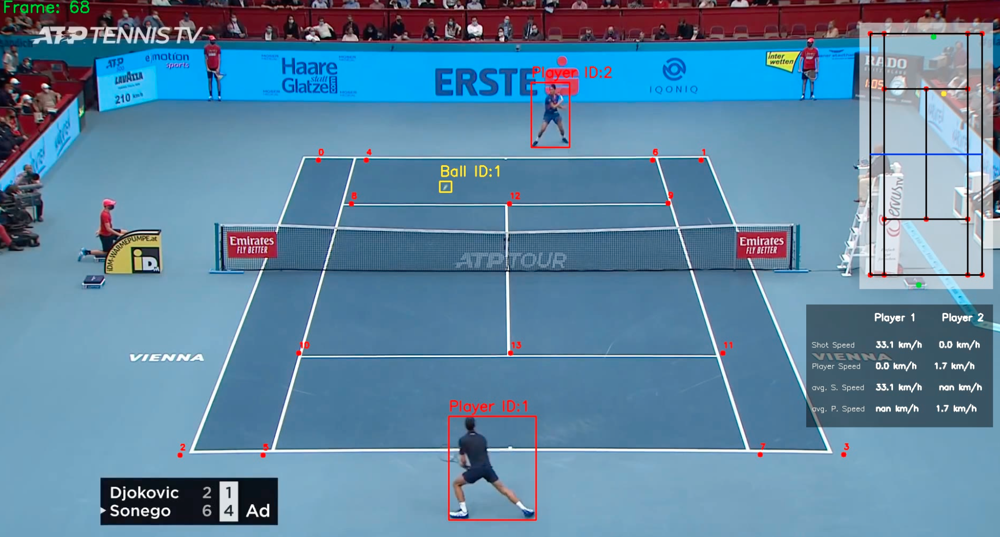

# AI Tennis Game Analysis

This project aims to analyze real-time tennis games using AI model and measures players speed, ball shoot speed and
number of players shots. The project uses YOLO model, which is a state-of-the-art, real-time object detection system
that is used to detect objects in images or video. It detects players and the tennis ball. The project also uses
CNNs to extract key points from the court. The project uses OpenCV to process the video and extract the frames.

# Installation

The projects uses Poetry to manage dependencies. All the dependencies are in `pyproject.toml`. To install the them, run
the following command:

```bash
poetry install
```

# Output video

A screenshot from the output video:



# Models used

- YOLO v8 for player detection
- Fine Tuned YOLO for tennis ball detection
- CNN model for court key points extraction

# Training

Training for the tennis ball and tennis court key points are written in notebooks:

- Tennis ball detector with YOLO: `src/tennis_ai/training/tennis_ball_detector_training.ipynb`
- Tennis court key points extraction with CNN: `src/tennis_ai/training/tennis_court_key_points_training.ipynb`

